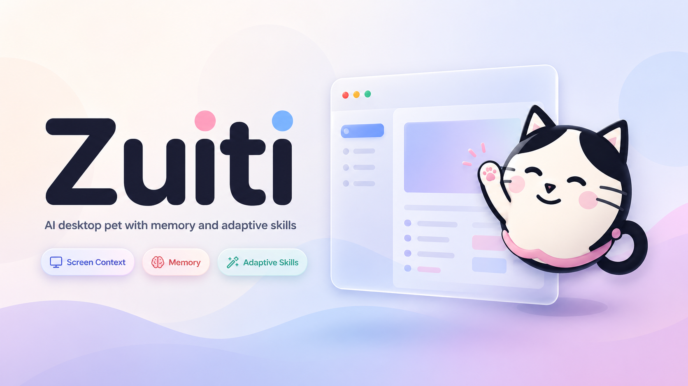
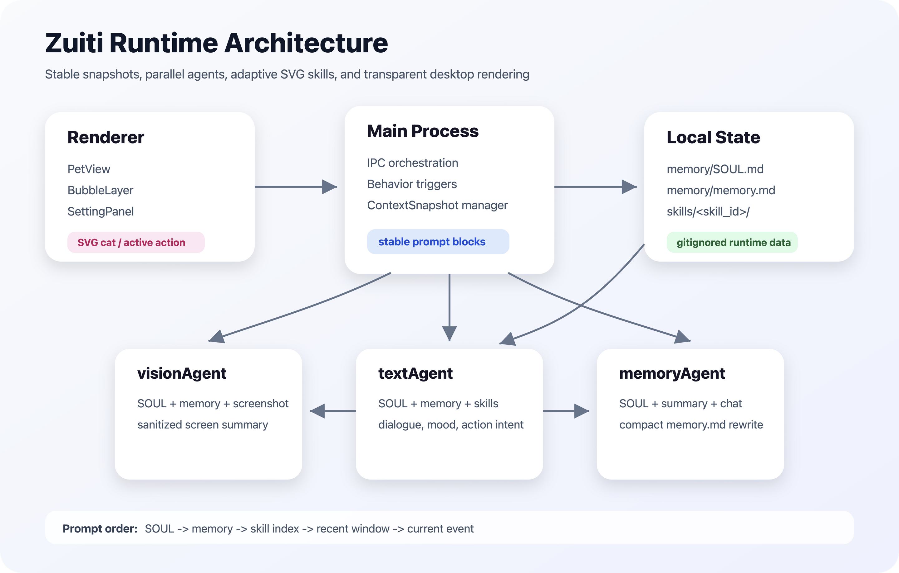

# Zuiti

**Language**: English | [简体中文](README-zh.md)



🐱 **Zuiti** is an AI desktop pet that lives beside the user's screen in a transparent floating window. It can understand the broad context of the current screen, maintain a compact long-term memory, and respond at the right moment with short natural dialogue and dynamic actions.

The project is not trying to wrap a conventional productivity assistant in a cute shell. It explores a more present, more emotionally aware desktop AI companion: one that cares without interrupting too much, uses screen context without feeling like surveillance, and gradually grows its own SVG action skills instead of being limited to fixed assets.

See [Project Overview](docs/overview.md) for more context.

## ✨ Key Features

- **Adaptive SVG action skills**: The LLM can generate SVG actions from an action intent, then save them locally under `skills/` after deterministic safety validation and visual review.
- **Stable context snapshots**: Text replies use the latest completed vision summary, memory, skill index, and short-term chat window without blocking on current screenshot or memory analysis jobs.
- **Compact long-term memory**: `SOUL.md` stores the pet's persona, while `memory.md` keeps only high-value, low-token long-term preferences and context.
- **Low-friction screen understanding**: Raw screenshots are not kept as long-term history; the dialogue context receives a sanitized semantic summary instead.
- **Transparent desktop pet UI**: Electron + React render the default SVG cat, dynamic actions, speech bubbles, input, and lightweight settings.
- **Local-first runtime state**: Runtime-generated memory and skills are ignored by git by default, keeping personal state local and experiments clean.

## 🚀 Quick Start

```bash
git clone https://github.com/C-Messi/Zuiti.git
cd Zuiti/zuiti-claude-opus-4.7
npm install
cp .env.example .env
npm run dev
```

Important `.env` variables:

| Variable | Values | Description |
| --- | --- | --- |
| `LLM_PROVIDER` | `openai` / `anthropic` / `mock` | LLM provider; `mock` can run the base flow offline |
| `LLM_BASE_URL` | Example: `https://api.openai.com/v1` | API base URL, including compatible providers |
| `LLM_API_KEY` | `sk-...` | API key |
| `LLM_TEXT_MODEL` | Example: `gpt-4o-mini` | Model for dialogue, memory, and skill authoring |
| `LLM_VISION_MODEL` | Example: `gpt-4o-mini` | Model for screenshot summaries and skill review |

Common commands:

```bash
npm run test:unit
npm run typecheck
npm run lint
npm run build
npm run build:mac
```

See [Development and Configuration](docs/modules/development.md) for more details.

## 🏗️ Architecture



Zuiti's runtime is composed of the renderer, main process, context snapshot manager, brain agents, vision, memory, and skills. The stable prompt order for the main reply is:

```text
SOUL -> memory -> skill index -> recent window -> current event
```

See [Architecture](docs/architecture.md) for the full design.

## 📚 Modules

| Module | Description | Docs |
| --- | --- | --- |
| Renderer | Default cat, dynamic SVG actions, speech bubbles, and settings panel | [docs/modules/renderer.md](docs/modules/renderer.md) |
| Brain Agents | Prompt and output protocol for textAgent, visionAgent, and memoryAgent | [docs/modules/brain-agents.md](docs/modules/brain-agents.md) |
| Skills | SVG skill package structure, generation, validation, review, and enablement | [docs/modules/skills.md](docs/modules/skills.md) |
| Memory | `SOUL.md`, `memory.md`, short-term sliding window, and git policy | [docs/modules/memory.md](docs/modules/memory.md) |
| Vision | Screenshot capture, privacy filtering, and sanitized screen summaries | [docs/modules/vision.md](docs/modules/vision.md) |
| Behavior | Proactive triggers, window observation, and interaction pacing | [docs/modules/behavior.md](docs/modules/behavior.md) |
| Development | Environment variables, commands, and commit notes | [docs/modules/development.md](docs/modules/development.md) |

The repository keeps one example skill at [`skills/example-soft-wave/`](skills/example-soft-wave/) and one example long-term memory file at [`memory/memory.example.md`](memory/memory.example.md). Real runtime-generated `skills/<skill_id>/` packages and `memory/memory.md` are ignored by default.

## 🚶 Roadmap

- **More robust skill review**: Add local pixel checks, style-consistency scoring, and recorded failure reasons.
- **Action composition**: Support short sequences made from multiple SVG skills instead of playing only one action at a time.
- **Finer privacy controls**: Provide clearer UI for app blocklists, sensitive windows, and screenshot pause behavior.
- **Memory review UI**: Add a read-only panel for the current `memory.md`, plus one-click clear or rollback.
- **Multiple pet personas**: Support switching between different `SOUL.md` templates and companion styles.
- **Release hardening**: Add macOS signing, notarization, auto-update, and release workflow support.

## 📜 License

Application code is released under the MIT License. Default visuals are repository SVG assets; generated action SVGs are stored locally under `skills/` by default.
